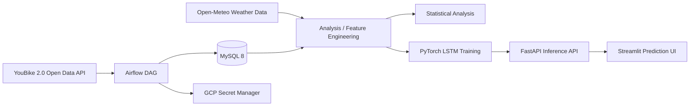
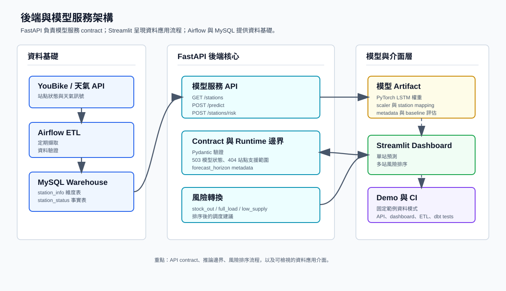
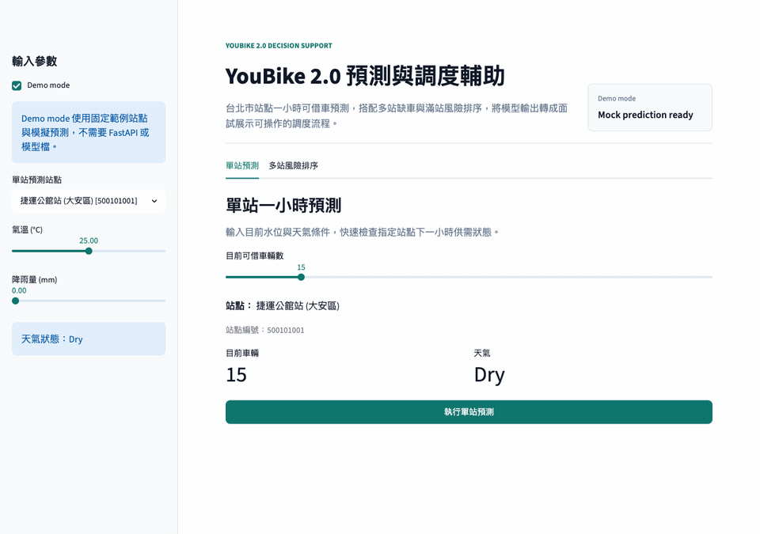
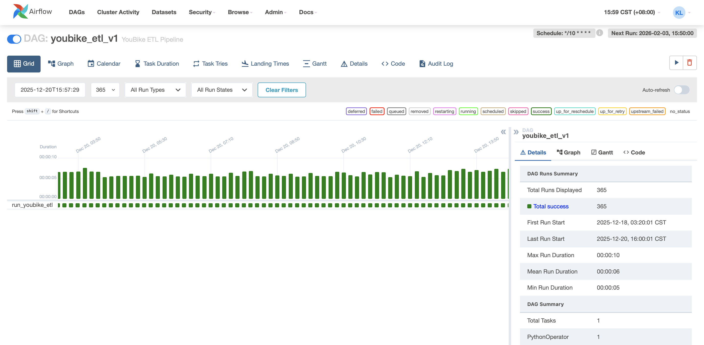
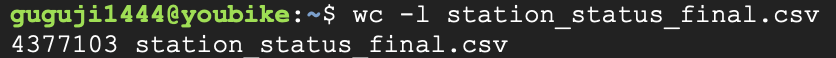
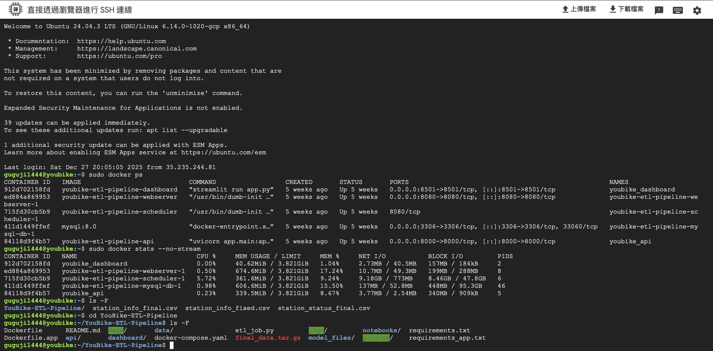
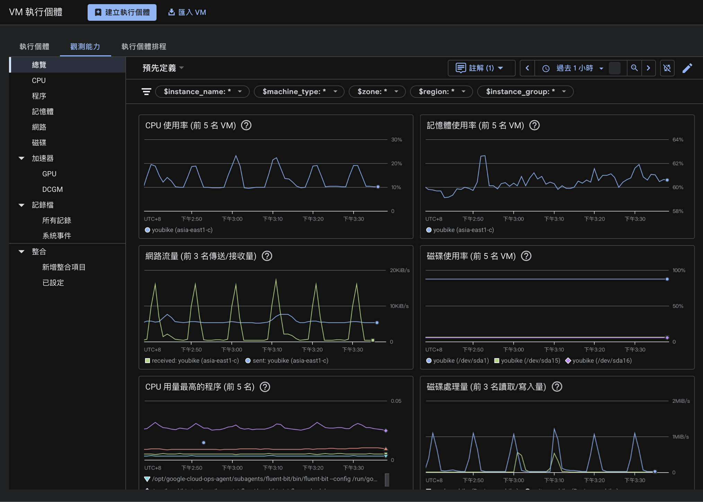

# Taipei YouBike 2.0 Data Engineering and Mobility Analytics

> A portfolio-scale data engineering and analytics project built on Taipei YouBike 2.0 open data, covering scheduled ingestion, relational data modeling, statistical analysis, LSTM training, and FastAPI model serving.

[中文 README](README.md)

## Summary

This project originated from a probability and statistics research report and was later extended into a data engineering and AI application portfolio project. The goal is to analyze supply-demand imbalance in Taipei's YouBike 2.0 system and evaluate whether high-frequency station data improves operational forecasting.

The project has three layers:

1. **Data engineering**: Airflow ingests YouBike station status every 10 minutes and stores normalized records in MySQL.
2. **Statistical analysis**: Descriptive statistics, t-tests, K-Means, ANOVA, chi-square testing, and regression are used to analyze station imbalance and regional behavior.
3. **Application serving**: A PyTorch LSTM model is served through FastAPI, with a Streamlit interface for single-station prediction and multi-station risk ranking.

This repository is a **portfolio showcase**, not an actively operated production service.

For a quick reviewer path, start with [`docs/reviewer_quickstart.md`](docs/reviewer_quickstart.md). For the shortest end-to-end project narrative, continue with [`docs/project_story.md`](docs/project_story.md). It connects the problem, data pipeline, analysis, LSTM prototype, FastAPI service, dashboard, limitations, and next steps.

## Quick Review Path

If you are reviewing this as a portfolio project:

1. **3-minute scan**: read [`docs/reviewer_quickstart.md`](docs/reviewer_quickstart.md), then inspect the backend / AI architecture diagram and dashboard GIF below.
2. **Backend focus**: read [`docs/api_contract_walkthrough.md`](docs/api_contract_walkthrough.md), `api/app/main.py`, and `tests/test_api.py` for FastAPI contracts, validation, readiness handling, and risk ranking.
3. **AI application focus**: read [`docs/demo_walkthrough.md`](docs/demo_walkthrough.md) and [`docs/ml_modeling_audit.md`](docs/ml_modeling_audit.md) for the demo workflow and model-claim boundaries.

The Chinese README is the primary narrative. This English README is the supporting scan version.

## Key Results

| Area | Result |
| --- | --- |
| Data volume | Processed 4M+ YouBike station status records |
| Ingestion | 10-minute micro-batch ingestion with Airflow |
| Data model | Split static station metadata and dynamic status logs into dimension / fact tables |
| Analysis | Used CV, t-tests, ANOVA, chi-square testing, and regression to identify imbalance patterns |
| Forecasting | Built a Multi-Station LSTM prototype with station, weather, and short-sequence status features, then packaged it as API artifacts |
| Serving | Exposed model inference and station risk ranking through FastAPI, with a Streamlit UI for prediction and redistribution support |
| Deployment evidence | Historical GCP VM deployment with Docker Compose, Airflow, MySQL, API, and dashboard services |
| Engineering hygiene | pytest coverage for ETL / API behavior and GitHub Actions CI |

## Problem Context

The operational problem is not simply a lack of bicycles. In many cases, bikes and empty docks are unevenly distributed across stations and time periods.

Common user pain points include:

- No bikes available at origin stations
- No empty docks at destination stations
- Sharp peak-hour imbalance between high-demand and low-demand areas

The analysis therefore focuses on variance, distribution shape, tail risk, and regional heterogeneity instead of city-wide averages alone.

## Architecture



Backend / AI application view:



Diagram notes: [`docs/backend_ai_architecture.md`](docs/backend_ai_architecture.md)

## Data Model

The MySQL schema is defined in `sql/init_schema.sql`, and the downstream analytics model is documented in the `analytics/dbt` dbt scaffold. Airflow owns ingestion into raw warehouse tables; dbt owns the staging and mart layer for analysis.

### `station_info`

Station dimension table:

- `station_no`
- `name_tw`
- `district`
- `lat`
- `lng`
- `total_spaces`

### `station_status`

Time-series station status fact table:

- `station_no`
- `bikes_available`
- `spaces_available`
- `record_time`

The schema uses `(station_no, record_time)` as a uniqueness constraint to prevent duplicate status records.

### dbt analytics layer

`analytics/dbt` provides seed fixtures and the following models:

- `station_info` / `station_status` seeds: small raw warehouse fixtures used by CI
- `stg_station_info`: cleaned station dimension model
- `stg_station_status`: cleaned station status model with stock-out and full-load risk flags
- `mart_station_hourly_health`: hourly station health metrics for dashboarding and downstream analysis
- `mart_district_peak_hour_health`: district-hour operational health metrics with peak/off-peak labeling

Use `profiles.example.yml` as a template for a real `profiles.yml`. Do not commit credentials. CI starts a disposable MySQL service and runs `dbt seed` and `dbt build`.

## Analytical Findings

### 1. Average Availability Hides Peak-Hour Instability

Peak and off-peak periods may show similar average availability, but the peak-hour coefficient of variation was around `0.7815`, indicating much higher instability during commute windows.

**Engineering implication**: station-level monitoring and high-frequency ingestion are necessary; city-wide daily aggregates are insufficient.

### 2. Campus Stations Behave Differently

t-tests showed that the NTU Gongguan area had significantly lower operating levels than nearby comparison areas. This suggests campus stations should not be managed only through district-level averages.

### 3. Land-Use Patterns Affect Station Behavior

K-Means clustering was used to categorize station behavior, followed by ANOVA and Tukey post-hoc comparison. The analysis separated commercial, residential, and mixed-use patterns.

Operational interpretation:

- Mixed-use areas tend to retain more bikes and need capacity-oriented planning.
- Commercial areas have higher turnover and need faster redistribution.
- Residential areas show stronger commute-driven rhythms.

### 4. Tail Risk Matters More Than the Mean

Chi-square testing and standardized residual analysis were used to identify severe stock-out hotspots. This better reflects real user experience than average availability alone.

### 5. High-Frequency Data Improves Predictive Power

Regression comparison showed that static location features alone had low explanatory power, while adding lag-style temporal features increased R-squared from roughly `0.02` to `0.92`. This number belongs to the statistical regression analysis and should be used as evidence that recent station state has predictive signal. It is not the LSTM test-set performance.

**Engineering implication**: 10-minute ingestion is central to the predictive value of the system.

## Model Serving

The prediction service uses a Multi-Station LSTM prototype with:

- current bike availability
- temperature
- rainfall
- rainfall category
- station ID embedding

The defensible claim is that the project contains an LSTM prototype and a FastAPI model-serving path. The notebooks record training loss and artifact generation, while `scripts/train_multistation_lstm.py` turns the multi-station training flow into a reproducible CLI that writes model weights, scaler, station mappings, and `model_metadata.json`. The metadata includes LSTM metrics, current-value, rolling-mean, same-time previous-day, and Ridge lag-regression baselines, MAE/RMSE deltas against each baseline, and a `model_selection` summary showing whether the candidate beat the best test-split baseline. Local checkpoint-data evaluations are documented in [`docs/lstm_evaluation_report.md`](docs/lstm_evaluation_report.md): for the next-observation target, the LSTM beat rolling mean and same-time previous-day but not current value or Ridge; for an approximate one-hour target (`horizon_steps=6`), it still did not beat the strongest baseline. It should therefore be positioned as a model-serving prototype rather than a proven accuracy improvement. See [`docs/ml_modeling_audit.md`](docs/ml_modeling_audit.md) for the full modeling audit.

```bash
make train-lstm
```

This command reads `data/processed/youbike_weather_merged.csv` and writes new artifacts to `.scratch/model_training`, so it does not accidentally overwrite the currently served artifacts in `api/model_files`. To intentionally replace the served model, inspect the train / validation / test metrics and `model_selection.recommendation` in `model_metadata.json` first, then run the script with `--output-dir api/model_files`.

FastAPI endpoints:

| Method | Path | Description |
| --- | --- | --- |
| GET | `/` | Service status |
| GET | `/stations` | Supported station list |
| POST | `/predict` | Predicts available bikes for the model horizon |
| POST | `/stations/risk` | Ranks multi-station stock-out / full-load risk |

`/predict` and `/stations/risk` accept optional `recent_observations`, a 3-row recent-history window for LSTM inference. When it is omitted and database credentials are available, the API attempts to load the latest three `bikes_available` rows from MySQL `station_status`. If the lookup cannot return three rows, or DB credentials are not configured, the API keeps the demo-compatible fallback and repeats the current state into a short sequence.

Note: the API keeps the legacy `predicted_bikes_next_hour` / `predicted_spaces_next_hour` response keys for compatibility with the original demo. Interpret the actual horizon through `forecast_horizon` and `forecast_horizon_description`. The current local evaluation uses `horizon_steps=1`, meaning the next observation rather than a proven one-hour forecast.

Example request:

```json
{
  "station_no": "500101001",
  "bikes_available": 12,
  "temperature": 27.5,
  "rain": 0.0,
  "recent_observations": [
    {"bikes_available": 10, "temperature": 27.0, "rain": 0.0},
    {"bikes_available": 11, "temperature": 27.2, "rain": 0.0},
    {"bikes_available": 12, "temperature": 27.5, "rain": 0.0}
  ]
}
```

Example response:

```json
{
  "station_no": "500101001",
  "predicted_bikes_next_hour": 10,
  "forecast_horizon": "model_artifact_horizon",
  "forecast_horizon_description": "Legacy response keys use next_hour naming, but current artifacts should be interpreted as the model-defined horizon. The documented local evaluation uses horizon_steps=1, meaning the next observation rather than a guaranteed one-hour forecast."
}
```

Risk-ranking request:

```json
{
  "temperature": 27.5,
  "rain": 0.0,
  "stations": [
    {
      "station_no": "500101001",
      "bikes_available": 2,
      "spaces_available": 18
    },
    {
      "station_no": "500101002",
      "bikes_available": 18,
      "spaces_available": 2
    }
  ]
}
```

Risk-ranking response:

```json
{
  "risks": [
    {
      "station_no": "500101001",
      "current_bikes_available": 2,
      "current_spaces_available": 18,
      "predicted_bikes_next_hour": 1,
      "predicted_spaces_next_hour": 19,
      "forecast_horizon": "model_artifact_horizon",
      "risk_level": "stock_out",
      "risk_score": 101,
      "suggested_action": "rebalance_in"
    }
  ],
  "forecast_horizon": "model_artifact_horizon"
}
```

`/stations/risk` reuses the LSTM inference path and converts predicted bikes and estimated empty docks into decision-support labels: `stock_out`, `full_load`, `low_supply`, `low_dock`, or `normal`.

The Streamlit dashboard now has two tabs:

- Single-station prediction: select one station, enter current availability and weather, then call `/predict` for the model-horizon forecast.
- Multi-station risk ranking: edit current bike / dock availability for multiple stations, then call `/stations/risk` to produce ranked operational actions.

## Dashboard Demo

The dashboard includes demo mode, so the single-station prediction and multi-station risk-ranking flow can be shown without starting FastAPI, loading model files, or running Docker Compose. The walkthrough below uses deterministic mock data for interview and portfolio demos; it is not a model evaluation result.



Static screenshot fallback: [`docs/images/dashboard_demo_risk_ranking.png`](docs/images/dashboard_demo_risk_ranking.png)

Silent preview video: [`docs/videos/youbike_backend_ai_demo_preview.mp4`](docs/videos/youbike_backend_ai_demo_preview.mp4)

Interview demo script: [`docs/demo_walkthrough.md`](docs/demo_walkthrough.md)

## Historical Deployment

This project was previously deployed on a GCP VM with Docker Compose. The original Tableau dashboard and Streamlit cloud demo were created for course presentation purposes and may no longer be online. For that reason, this README does not publish old VM IPs or expired demo links.

Evidence screenshots are retained for portfolio context:

### Airflow Scheduling



### Data Volume



### Docker Services



### GCP Monitoring



## Tech Stack

| Area | Technologies |
| --- | --- |
| Workflow | Apache Airflow |
| Data Processing | Python, Pandas, SQLAlchemy |
| Database | MySQL 8 |
| Backend | FastAPI, Pydantic, Uvicorn |
| ML | PyTorch, scikit-learn, joblib |
| Dashboard | Streamlit, Tableau |
| Infrastructure | Docker, Docker Compose, GCP VM, GCP Secret Manager |
| Analytics Engineering | dbt scaffold, source/model tests, staging/mart models |
| Testing / CI | pytest, FastAPI TestClient, GitHub Actions |

## Project Structure

```text
YouBike-ETL-Pipeline/
├── api/
│   ├── app/
│   │   └── main.py                 # FastAPI inference service
│   └── model_files/                # LSTM weights, scaler, station mappings
├── dags/
│   ├── youbike_dag.py              # Airflow ETL DAG
│   └── youbike_transform.py        # Shared YouBike transform logic
├── dashboard/
│   └── app.py                      # Streamlit prediction UI
├── analytics/
│   └── dbt/                        # dbt analytics layer scaffold
├── docs/
│   ├── adr/                        # Maintenance decisions
│   └── images/                     # Deployment and data-volume evidence
├── notebooks/
│   ├── 01_youbike_analysis.ipynb
│   ├── 02_weather_etl.ipynb
│   ├── 03_data_merge.ipynb
│   ├── 04_lstm_prediction.ipynb
│   ├── 05_multistation_lstm.ipynb
│   └── 06_tableau_master_dataset.ipynb
├── sql/
│   └── init_schema.sql             # MySQL schema
├── tests/
│   ├── test_api.py                 # FastAPI behavior tests
│   └── test_etl.py                 # ETL transform tests
├── docker-compose.yaml
├── Dockerfile
├── Dockerfile.app
├── etl_job.py
├── Makefile
├── requirements.txt
├── requirements-dev.txt
├── requirements-dbt.txt
├── requirements-test.txt
└── requirements_app.txt
```

## Local Run

### 1. Create environment variables

```bash
cp .env.example .env
```

At minimum:

```env
MYSQL_ROOT_PASSWORD=your_root_password_here
MYSQL_DATABASE=youbike_db
MYSQL_USER=youbike
MYSQL_PASSWORD=your_app_password_here
```

### 2. Start services

```bash
make up
```

Default services:

- Airflow UI: http://localhost:8080
- FastAPI docs: http://localhost:8000/docs
- Streamlit dashboard: http://localhost:8501
- MySQL: localhost:3306

For interview demos where you only need the dashboard and do not want to depend on live FastAPI services, model files, or Docker Compose, enable demo mode:

```bash
make install-app
make dashboard-demo
```

This is equivalent to running `DASHBOARD_DEMO_MODE=true streamlit run dashboard/app.py`. Demo mode uses fixed sample stations and deterministic mock prediction. It is useful for demonstrating the single-station prediction and multi-station risk-ranking flow; it is not a model evaluation result.

ETL runs data-quality validation before loading. The default `ETL_VALIDATION_MODE=strict` fails on duplicate status keys, negative availability, or non-numeric availability fields. Set `ETL_VALIDATION_MODE=warn` to log validation failures and continue.

### 3. Run tests

```bash
make install-dev
make test
```

The tests cover ETL transform logic, basic FastAPI behavior, the dashboard client, and a small-fixture run of the LSTM training script. They do not require MySQL or GCP access and do not load real model artifacts.

GitHub Actions runs Python tests and starts a MySQL service for dbt seed/build on push and pull request events.

### 4. Run the dbt analytics scaffold

dbt is optional and requires a local `analytics/dbt/profiles.yml`:

```bash
cp analytics/dbt/profiles.example.yml analytics/dbt/profiles.yml
```

After setting the MySQL connection environment variables:

```bash
make install-dbt
make dbt-parse
make dbt-build
```

`make install-dbt` creates a dedicated `.venv-dbt` so dbt dependencies do not modify the system Python. `dbt-mysql` is currently validated with Python 3.11. If your local default Python is 3.12+, run `DBT_PYTHON=/path/to/python3.11 make install-dbt`.

The public repository does not include database credentials. CI validates the dbt layer against a disposable MySQL service and seed fixtures.

## Test Coverage

Current tests cover:

- ETL empty-input and missing-column handling
- ETL successful transform behavior, station deduplication, and Taipei-time to UTC conversion
- ETL post-transform validation for duplicate status keys, negative availability, and non-numeric availability fields
- FastAPI health endpoint
- `/stations` model-not-ready behavior
- `/predict` request validation, `recent_observations` lag-window behavior, and warehouse lookup fallback behavior
- `/stations/risk` batch ranking, request validation, unknown station behavior, and per-station `recent_observations`
- dashboard API client payloads, demo mode, error handling, and display label mapping
- LSTM training script station selection, sequence splitting, baseline evaluation, artifact output, and metadata output
- unknown station handling
- mocked model prediction response
- dbt seed fixtures, source/model tests, and staging/mart build

CI configuration lives in `.github/workflows/ci.yml`.

## Known Limitations

- This repository is a portfolio showcase, not an actively operated production service.
- The Tableau dashboard and old Streamlit cloud demo may no longer be online.
- ETL transform logic is shared; extract/load code still differs between the standalone job and Airflow DAG because their runtime environments differ.
- The ETL validation gate defaults to strict mode; use `ETL_VALIDATION_MODE=warn` if transient API anomalies should be logged without interrupting the run.
- The dbt analytics layer currently uses seed fixtures for model validation; full analysis requires connecting to the real MySQL warehouse.
- `/predict` accepts manual `recent_observations` and can query the latest three bike counts from MySQL `station_status` when DB credentials are configured; the automatic lookup still reuses the request temperature / rain because the warehouse does not currently store weather history. The API keeps `next_hour` response keys for compatibility, but the actual horizon should be read from response metadata.
- The LSTM training flow now has a script, a baseline suite, a Ridge lag-regression baseline, and small tests; local checkpoint-data evaluations show the current LSTM does not beat the strongest baseline for either the next-observation or approximate one-hour horizon. Because the full processed training CSV is not committed, fresh clones cannot directly reproduce the full-data evaluation.
- Dashboard demo mode is a deterministic mock for interviews, not a real model-performance result.

## Role Relevance

For job-search positioning, this project is strongest for backend / AI application engineering, with data engineering as the supporting context:

- Backend / AI application engineering: FastAPI, Pydantic validation, inference APIs, risk-ranking workflows, Docker Compose
- Data application engineering: analytics, feature engineering, model serving, dashboard support
- Data engineering: ETL, Airflow, MySQL schema design, batch ingestion, data-quality testing

It does not claim to cover full-scale big-data platform work such as Spark, Kafka, Data Lake, Kubernetes, or complete MLOps. The dbt layer is a lightweight analytics scaffold, not a full enterprise warehouse implementation. For backend / AI application roles, use the framing in [`docs/backend_ai_positioning.md`](docs/backend_ai_positioning.md).

## Maintenance Roadmap

A fuller portfolio assessment and prioritization note is available in [`docs/portfolio_assessment.md`](docs/portfolio_assessment.md), the reviewer quickstart is in [`docs/reviewer_quickstart.md`](docs/reviewer_quickstart.md), backend / AI application framing is in [`docs/backend_ai_positioning.md`](docs/backend_ai_positioning.md), the backend / AI architecture diagram is in [`docs/backend_ai_architecture.md`](docs/backend_ai_architecture.md), the demo walkthrough is in [`docs/demo_walkthrough.md`](docs/demo_walkthrough.md), the API contract walkthrough is in [`docs/api_contract_walkthrough.md`](docs/api_contract_walkthrough.md), the documentation language strategy is in [`docs/documentation_language_strategy.md`](docs/documentation_language_strategy.md), the interview script is in [`docs/interview_talk_track.md`](docs/interview_talk_track.md), the report storyline is in [`docs/project_story.md`](docs/project_story.md), the ML modeling boundary is documented in [`docs/ml_modeling_audit.md`](docs/ml_modeling_audit.md), and the local LSTM evaluation is in [`docs/lstm_evaluation_report.md`](docs/lstm_evaluation_report.md).

1. If deepening ML, add aligned weather history and richer lag features.
2. If improving job-search materials, record a 60-90 second demo video.

## Author

Kevin Lin, 2025
