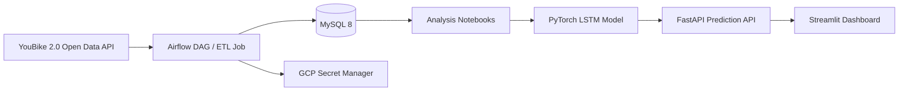

# Taipei YouBike 2.0 Prediction and Data Application

> AI backend / data application portfolio project: Airflow ETL, MySQL time-series storage, FastAPI model serving, Streamlit dashboard, and PyTorch LSTM forecasting.

[中文 README](README.md)

## Project Positioning

This project uses Taipei YouBike 2.0 open data to demonstrate an end-to-end data application. It ingests real-time station data, stores station metadata and status logs in MySQL, schedules ingestion through Airflow, serves LSTM predictions through FastAPI, and exposes an interactive Streamlit dashboard.

The goal is not to present this as a large commercial mobility product. The value of this repo is that it connects data ingestion, backend APIs, model inference, and containerized deployment into a portfolio-scale system that can be explained, maintained, and demonstrated.

It is useful for showing:

- Backend service design: FastAPI endpoints, Pydantic validation, startup-time model loading
- AI application integration: wrapping a PyTorch LSTM model behind a REST API
- Data engineering fundamentals: Airflow scheduling, ETL, MySQL schema design, time-series writes
- Containerized deployment: Docker Compose services for Airflow, MySQL, API, and dashboard
- Analytical storytelling: statistical testing, clustering, peak-hour imbalance, and station-level demand patterns

## System Overview



Core tables:

- `station_info`: station dimension table with station id, name, district, latitude, longitude, and capacity
- `station_status`: station status fact table with available bikes, available return spaces, and record time

## Project Evidence

This project was previously deployed on a GCP VM through Docker Compose and collected more than 4M YouBike station status records. Screenshots are kept as portfolio evidence, while VM IPs, credentials, and cloud project details are intentionally omitted.

### Airflow Scheduling


- Airflow triggered ingestion every 10 minutes
- The ETL flow split station metadata from station status records
- Status records were appended to `station_status`

### Data Volume


- More than 4M station status records were processed
- The MySQL schema uses a station dimension table and a status fact table to avoid repeatedly storing static station metadata

### Containers and Cloud Deployment


- Docker Compose managed Airflow webserver, scheduler, MySQL, FastAPI, and Streamlit
- GCP Secret Manager was used for database password access in the deployment environment
- The repository keeps only `.env.example`; real `.env` files are not committed

### Basic Cloud Monitoring


- GCP VM metrics showed CPU and network activity aligned with scheduled ETL jobs
- Screenshots document that the deployment and scheduler ran in practice, not that the system is currently operated as a live service

## Analytical Highlights

### 1. The Average Trap

Peak and off-peak periods may show similar average availability, but peak-hour variance is much higher. The operational issue is therefore not only total supply, but also imbalance between stations.

### 2. Campus Area Effect

Stations around the NTU Gongguan area showed recurring stock-out or full-load patterns at specific times. This suggests that station context matters more than simple district-level averages.

### 3. Land-Use Pattern Differences

Residential, commercial, and mixed-use areas show different usage rhythms. The notebooks explore these differences through statistical analysis and clustering.

### 4. Importance of Dynamic Features

Station location alone is weak for predicting available bikes. Adding lag features significantly improves forecasting, which is why the project keeps both scheduled ingestion and time-series storage.

## API and Dashboard

The FastAPI service is implemented in `api/app/main.py`.

Main endpoints:

- `GET /`: service status
- `GET /stations`: station ids supported by the model
- `POST /predict`: predicts available bikes one hour later from station id, current bikes, temperature, and rain

Example request:

```json
{
  "station_no": "500101001",
  "bikes_available": 12,
  "temperature": 27.5,
  "rain": 0.0
}
```

Example response:

```json
{
  "station_no": "500101001",
  "predicted_bikes_next_hour": 10
}
```

The Streamlit dashboard in `dashboard/app.py` provides station selection, weather inputs, and prediction display.

## Tech Stack

- Backend: FastAPI, Pydantic, Uvicorn
- ML / AI: PyTorch LSTM, scikit-learn, joblib
- Data Engineering: Airflow, Pandas, SQLAlchemy
- Database: MySQL 8
- Dashboard: Streamlit
- Infrastructure: Docker, Docker Compose, GCP VM, GCP Secret Manager
- Analysis: Jupyter Notebook, statistical testing, clustering, model comparison

## Project Structure

```text
YouBike-ETL-Pipeline/
├── api/
│   ├── app/
│   │   └── main.py                 # FastAPI model inference service
│   └── model_files/                # LSTM weights, scaler, station mappings
├── dags/
│   └── youbike_dag.py              # Airflow ETL DAG
├── dashboard/
│   └── app.py                      # Streamlit prediction UI
├── data/
│   └── raw/                        # Raw files for analysis
├── docs/
│   ├── adr/                        # Maintenance decisions
│   └── images/                     # Portfolio evidence screenshots
├── notebooks/
│   ├── 01_youbike_analysis.ipynb
│   ├── 02_weather_etl.ipynb
│   ├── 03_data_merge.ipynb
│   ├── 04_lstm_prediction.ipynb
│   ├── 05_multistation_lstm.ipynb
│   └── 06_tableau_master_dataset.ipynb
├── sql/
│   └── init_schema.sql             # MySQL schema
├── tests/
│   └── test_etl.py                 # ETL transform unit tests
├── docker-compose.yaml
├── Dockerfile                      # Airflow image
├── Dockerfile.app                  # API / Dashboard image
├── etl_job.py                      # Standalone ETL job
├── Makefile                        # Local maintenance commands
├── requirements.txt
├── requirements-dev.txt
├── requirements-test.txt
└── requirements_app.txt
```

## Local Run

### 1. Create environment variables

```bash
cp .env.example .env
```

At minimum:

```env
MYSQL_ROOT_PASSWORD=your_root_password_here
MYSQL_DATABASE=youbike_db
MYSQL_USER=youbike
MYSQL_PASSWORD=your_app_password_here
```

### 2. Start services

```bash
make up
```

Default services:

- Airflow UI: http://localhost:8080
- FastAPI docs: http://localhost:8000/docs
- Streamlit dashboard: http://localhost:8501
- MySQL: localhost:3306

### 3. Run tests

```bash
make install-dev
make test
```

The current tests cover ETL transform logic and basic FastAPI behavior. They do not require MySQL or GCP access and do not load real model artifacts.

`requirements-dev.txt` currently installs only the dependencies needed for local tests. For the full notebook / analysis environment, install `requirements.txt` separately.

Without `make`, run the underlying commands directly:

```bash
docker-compose up -d --build
python -m pip install -r requirements-test.txt
python -m pytest tests/ -v
```

## Model Training

The main training notebook is:

```text
notebooks/05_multistation_lstm.ipynb
```

Trained model and preprocessing assets are stored in:

```text
api/model_files/
```

FastAPI loads:

- `youbike_lstm_multistation.pth`
- `scaler.pkl`
- `station_mapping.pkl`
- `station_info_map.pkl`

## Known Limitations

This repository is a portfolio showcase, not an actively operated production service.

- ETL logic is currently duplicated between `etl_job.py` and `dags/youbike_dag.py`; it can be extracted into a shared Python module
- `POST /predict` uses the current state to construct a short sequence for demo-time inference; production forecasting should use real lag windows from the database
- Notebook-based training has not yet been converted into a fully reproducible training script
- Deployment screenshots are historical evidence; public documentation intentionally excludes VM IPs and cloud resource details

## Interview Pitch

One-sentence version:

> I built a YouBike prediction data application that connects Airflow ETL, MySQL time-series storage, LSTM training, FastAPI model inference, and a Streamlit dashboard, processing 4M+ station status records.

Backend-focused version:

> This project shows how I wrap a model behind an API, handle request validation, load model resources at startup, manage Docker Compose service networking, and connect the API to a dashboard.

AI-application-focused version:

> This project goes beyond notebooks by serving an LSTM forecasting model through FastAPI and exposing it through an interactive dashboard.

Data-engineering-focused version:

> This project uses Airflow to periodically ingest YouBike real-time data into a MySQL dimension/fact schema, then uses the accumulated data for analysis and model training.

## Maintenance Roadmap

Short-term priorities:

1. Extract ETL transform/load logic into a shared Python module so the Airflow DAG only handles orchestration
2. Extend FastAPI endpoint tests with additional inference edge cases
3. Extend local verification with Docker Compose health checks
4. Add a batch risk endpoint such as `/stations/risk` to make the project stronger for AI application roles

## Author

Kevin Lin, 2025
