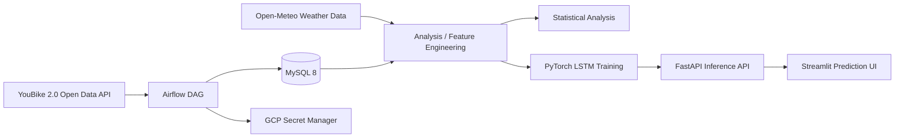
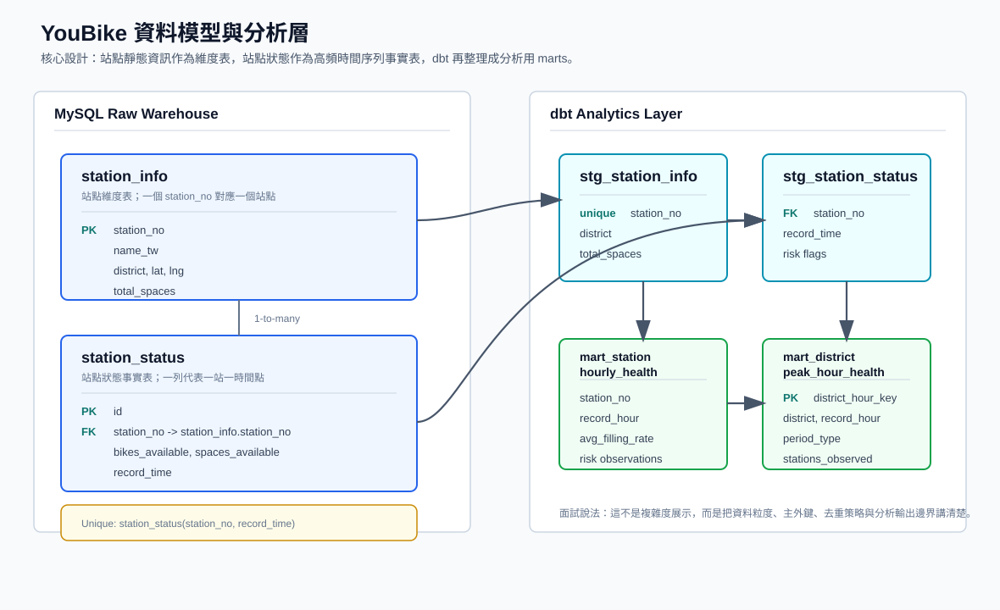
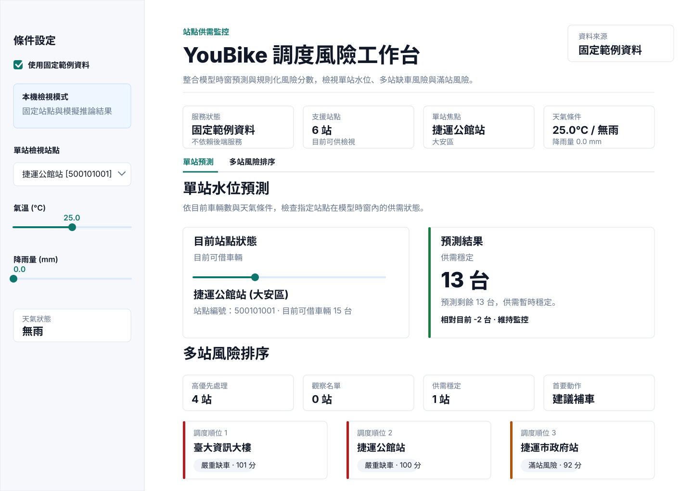

# Taipei YouBike 2.0 Data Engineering and Mobility Analytics

> A portfolio-scale data engineering and analytics project built on Taipei YouBike 2.0 open data, covering scheduled ingestion, relational data modeling, statistical analysis, LSTM training, and FastAPI model serving.

[中文 README](README.md)

## Summary

This project originated from a probability and statistics research report and was later extended into a data engineering and AI application portfolio project. The goal is to analyze supply-demand imbalance in Taipei's YouBike 2.0 system and evaluate whether high-frequency station data improves operational forecasting.

The project has three layers:

1. **Data engineering**: Airflow ingests YouBike station status every 10 minutes and stores normalized records in MySQL.
2. **Statistical analysis**: Descriptive statistics, t-tests, K-Means, ANOVA, chi-square testing, and regression are used to analyze station imbalance and regional behavior.
3. **Application serving**: A PyTorch LSTM model is served through FastAPI, with a Streamlit interface for single-station prediction and multi-station risk ranking.

This repository is a portfolio project rather than an actively operated production service. The Chinese README is the primary project narrative; this English README is a concise companion.

For the end-to-end project narrative, see [`docs/project_story.md`](docs/project_story.md). API behavior is documented in [`docs/api_contract_walkthrough.md`](docs/api_contract_walkthrough.md), observability design is documented in [`docs/observability.md`](docs/observability.md), configuration and security boundaries are documented in [`docs/configuration_security.md`](docs/configuration_security.md), local API benchmark profiles are documented in [`docs/performance_load_test.md`](docs/performance_load_test.md), and model evaluation boundaries are documented in [`docs/ml_modeling_audit.md`](docs/ml_modeling_audit.md) and [`docs/lstm_evaluation_report.md`](docs/lstm_evaluation_report.md).

## Key Results

| Area | Result |
| --- | --- |
| Data volume | Processed 4M+ YouBike station status records |
| Ingestion | 10-minute micro-batch ingestion with Airflow |
| Data model | Split static station metadata and dynamic status logs into dimension / fact tables |
| Analysis | Used CV, t-tests, ANOVA, chi-square testing, and regression to identify imbalance patterns |
| Forecasting | Built a Multi-Station LSTM prototype with station, weather, and short-sequence status features, then packaged it as API artifacts |
| Serving | Exposed model inference and station risk ranking through FastAPI, with a Streamlit UI for prediction and redistribution support |
| Deployment evidence | Historical GCP VM deployment with Docker Compose, Airflow, MySQL, API, and dashboard services |
| Engineering hygiene | pytest coverage for ETL / API behavior, OpenAPI schema export, request examples, request tracing, Prometheus-style metrics, local API benchmark profiles, and GitHub Actions CI |

## Problem Context

The operational problem is not simply a lack of bicycles. In many cases, bikes and empty docks are unevenly distributed across stations and time periods.

Common user pain points include:

- No bikes available at origin stations
- No empty docks at destination stations
- Sharp peak-hour imbalance between high-demand and low-demand areas

The analysis therefore focuses on variance, distribution shape, tail risk, and regional heterogeneity instead of city-wide averages alone.

## Architecture



Backend / AI application view:


Diagram notes: [`docs/backend_ai_architecture.md`](docs/backend_ai_architecture.md)

## Data Model

The MySQL schema is defined in `sql/init_schema.sql`, and the downstream analytics model is documented in the `analytics/dbt` dbt scaffold. Airflow owns ingestion into raw warehouse tables; dbt owns the staging and mart layer for analysis.



The data model follows a simple dimensional pattern: `station_info` stores slowly changing station attributes, while `station_status` stores one station-state observation per timestamp. Downstream dbt models aggregate the raw facts by station-hour and district-hour for analysis, dashboarding, and model feature checks.

### `station_info`

Station dimension table:

- `station_no`
- `name_tw`
- `district`
- `lat`
- `lng`
- `total_spaces`

### `station_status`

Time-series station status fact table:

- `station_no`
- `bikes_available`
- `spaces_available`
- `record_time`

The schema uses `(station_no, record_time)` as a uniqueness constraint to prevent duplicate status records.

### dbt analytics layer

`analytics/dbt` provides seed fixtures and the following models:

- `station_info` / `station_status` seeds: small raw warehouse fixtures used by CI
- `stg_station_info`: cleaned station dimension model
- `stg_station_status`: cleaned station status model with stock-out and full-load risk flags
- `mart_station_hourly_health`: hourly station health metrics for dashboarding and downstream analysis
- `mart_district_peak_hour_health`: district-hour operational health metrics with peak/off-peak labeling

Use `profiles.example.yml` as a template for a real `profiles.yml`. Do not commit credentials. CI starts a disposable MySQL service and runs `dbt seed` and `dbt build`.

## Analytical Findings

### 1. Average Availability Hides Peak-Hour Instability

Peak and off-peak periods may show similar average availability, but the peak-hour coefficient of variation was around `0.7815`, indicating much higher instability during commute windows.

**Engineering implication**: station-level monitoring and high-frequency ingestion are necessary; city-wide daily aggregates are insufficient.

### 2. Campus Stations Behave Differently

t-tests showed that the NTU Gongguan area had significantly lower operating levels than nearby comparison areas. This suggests campus stations should not be managed only through district-level averages.

### 3. Land-Use Patterns Affect Station Behavior

K-Means clustering was used to categorize station behavior, followed by ANOVA and Tukey post-hoc comparison. The analysis separated commercial, residential, and mixed-use patterns.

Operational interpretation:

- Mixed-use areas tend to retain more bikes and need capacity-oriented planning.
- Commercial areas have higher turnover and need faster redistribution.
- Residential areas show stronger commute-driven rhythms.

### 4. Tail Risk Matters More Than the Mean

Chi-square testing and standardized residual analysis were used to identify severe stock-out hotspots. This better reflects real user experience than average availability alone.

### 5. High-Frequency Data Improves Predictive Power

Regression comparison showed that static location features alone had low explanatory power, while adding lag-style temporal features increased R-squared from roughly `0.02` to `0.92`. This number belongs to the statistical regression analysis and should be used as evidence that recent station state has predictive signal. It is not the LSTM test-set performance.

**Engineering implication**: 10-minute ingestion is central to the predictive value of the system.

## Model Serving

The prediction service uses a Multi-Station LSTM prototype with:

- current bike availability
- temperature
- rainfall
- rainfall category
- station ID embedding

The defensible claim is that the project contains an LSTM prototype and a FastAPI model-serving path. The notebooks record training loss and artifact generation, while `scripts/train_multistation_lstm.py` turns the multi-station training flow into a reproducible CLI that writes model weights, scaler, station mappings, and `model_metadata.json`. The metadata includes LSTM metrics, current-value, rolling-mean, same-time previous-day, and Ridge lag-regression baselines, MAE/RMSE deltas against each baseline, and a `model_selection` summary showing whether the candidate beat the best test-split baseline. Local checkpoint-data evaluations are documented in [`docs/lstm_evaluation_report.md`](docs/lstm_evaluation_report.md): for the next-observation target, the LSTM beat rolling mean and same-time previous-day but not current value or Ridge; for an approximate one-hour target (`horizon_steps=6`), it still did not beat the strongest baseline. It should therefore be positioned as a model-serving prototype rather than a proven accuracy improvement. See [`docs/ml_modeling_audit.md`](docs/ml_modeling_audit.md) for the full modeling audit.

```bash
make train-lstm
```

This command reads `data/processed/youbike_weather_merged.csv` and writes new artifacts to `.scratch/model_training`, so it does not accidentally overwrite the currently served artifacts in `api/model_files`. To intentionally replace the served model, inspect the train / validation / test metrics and `model_selection.recommendation` in `model_metadata.json` first, then run the script with `--output-dir api/model_files`.

The API returns model lineage fields from `/health`, `/ready`, `/predict`, and `/stations/risk`: `model_version`, `model_artifact_hash`, `model_metadata_loaded`, and `model_metadata_generated_at`. When `model_metadata.json` is present, the served version is derived from metadata and the artifact hash; when metadata is absent, the API still hashes the loaded model, scaler, and station mapping files so each prediction can be traced to a specific served artifact set.

FastAPI endpoints:

| Method | Path | Description |
| --- | --- | --- |
| GET | `/` | Service status |
| GET | `/health` | Process-level health check with model and data-resource load state |
| GET | `/ready` | Inference-readiness check; in normal mode it returns 200 only when model, scaler, and station metadata are loaded; API demo mode uses fixed sample data |
| GET | `/metrics` | Prometheus-style text metrics with request count, 5xx error count, and latency histogram |
| GET | `/stations` | Supported station list |
| POST | `/predict` | Predicts available bikes for the model horizon |
| POST | `/stations/risk` | Ranks multi-station stock-out / full-load risk |

`/predict` and `/stations/risk` accept optional `recent_observations`, a 3-row recent-history window for LSTM inference. When it is omitted and database credentials are available, the API attempts to load the latest three `bikes_available` rows from MySQL `station_status`. If the lookup cannot return three rows, or DB credentials are not configured, the API keeps the demo-compatible fallback and repeats the current state into a short sequence.

For API contract inspection without model files, MySQL, or Docker Compose, run with `API_DEMO_MODE=true` or `make api-demo`. In this mode `/ready` returns 200 and `/predict` / `/stations/risk` return deterministic simulated responses. It is for API workflow inspection, not model evaluation. The OpenAPI schema and local request examples can be regenerated with `make api-contract`, which writes [`docs/openapi.json`](docs/openapi.json) and [`docs/api_examples.http`](docs/api_examples.http).

API responses include `X-Request-ID`. If the caller sends the header, the service echoes it; otherwise the service generates one. API logs use JSON event records; request-completion logs include `request_id`, `method`, `path`, `status_code`, `duration_ms`, and `model_version`.

`/metrics` returns lightweight Prometheus-style metrics for request count, 5xx error count, duration sum/count/max, and latency histograms per endpoint. It is basic local/demo observability, not a complete production monitoring stack. PromQL examples and draft alert rules are documented in [`docs/observability.md`](docs/observability.md).

Note: the API keeps the legacy `predicted_bikes_next_hour` / `predicted_spaces_next_hour` response keys for compatibility with the original demo. Interpret the actual horizon through `forecast_horizon` and `forecast_horizon_description`. The current local evaluation uses `horizon_steps=1`, meaning the next observation rather than a proven one-hour forecast.

Example request:

```json
{
  "station_no": "500101001",
  "bikes_available": 12,
  "temperature": 27.5,
  "rain": 0.0,
  "recent_observations": [
    {"bikes_available": 10, "temperature": 27.0, "rain": 0.0},
    {"bikes_available": 11, "temperature": 27.2, "rain": 0.0},
    {"bikes_available": 12, "temperature": 27.5, "rain": 0.0}
  ]
}
```

Example response:

```json
{
  "station_no": "500101001",
  "predicted_bikes_next_hour": 10,
  "forecast_horizon": "model_artifact_horizon",
  "forecast_horizon_description": "Legacy response keys use next_hour naming, but current artifacts should be interpreted as the model-defined horizon. The documented local evaluation uses horizon_steps=1, meaning the next observation rather than a guaranteed one-hour forecast.",
  "model_version": "legacy-artifact-ea8d8266925da66f",
  "model_artifact_hash": "sha256:ea8d8266925da66f",
  "model_metadata_loaded": false,
  "model_metadata_generated_at": null
}
```

Risk-ranking request:

```json
{
  "temperature": 27.5,
  "rain": 0.0,
  "stations": [
    {
      "station_no": "500101001",
      "bikes_available": 2,
      "spaces_available": 18
    },
    {
      "station_no": "500101002",
      "bikes_available": 18,
      "spaces_available": 2
    }
  ]
}
```

Risk-ranking response:

```json
{
  "risks": [
    {
      "station_no": "500101001",
      "current_bikes_available": 2,
      "current_spaces_available": 18,
      "predicted_bikes_next_hour": 1,
      "predicted_spaces_next_hour": 19,
      "forecast_horizon": "model_artifact_horizon",
      "risk_level": "stock_out",
      "risk_score": 101,
      "suggested_action": "rebalance_in"
    }
  ],
  "forecast_horizon": "model_artifact_horizon",
  "model_version": "legacy-artifact-ea8d8266925da66f",
  "model_artifact_hash": "sha256:ea8d8266925da66f",
  "model_metadata_loaded": false,
  "model_metadata_generated_at": null
}
```

`/stations/risk` reuses the LSTM inference path and converts predicted bikes and estimated empty docks into decision-support labels: `stock_out`, `full_load`, `low_supply`, `low_dock`, or `normal`.

The Streamlit dashboard now has two tabs:

- Single-station prediction: select one station, enter current availability and weather, then call `/predict` for the model-horizon forecast.
- Multi-station risk ranking: edit current bike / dock availability for multiple stations, then call `/stations/risk` to produce ranked operational actions.

## Dashboard Preview

The dashboard includes a fixed-sample-data mode, so the single-station prediction and multi-station risk-ranking flow can be inspected without starting FastAPI, loading model files, or running Docker Compose. The preview below reflects the current dashboard design. The fixed sample data shows the UI flow and API-shaped response fields; it is not a model evaluation result.



## Historical Deployment

This project was previously deployed on a GCP VM with Docker Compose. The Tableau Public dashboard is still available and shows the map distribution and 24-hour availability trend for 13 representative stations:

- [Tableau Public: Taipei YouBike 13-station monitoring and trend analysis](https://public.tableau.com/app/profile/.40927878/viz/YouBike_17669139069900/1)

The old Streamlit cloud demo was created for course presentation purposes and may no longer be online. For that reason, this README does not publish old VM IPs or expired demo links.

Evidence screenshots are retained for portfolio context:

### Airflow Scheduling


### Data Volume


### Docker Services


### GCP Monitoring


## Tech Stack

| Area | Technologies |
| --- | --- |
| Workflow | Apache Airflow |
| Data Processing | Python, Pandas, SQLAlchemy |
| Database | MySQL 8 |
| Backend | FastAPI, Pydantic, Uvicorn |
| ML | PyTorch, scikit-learn, joblib |
| Dashboard | Streamlit, Tableau |
| Infrastructure | Docker, Docker Compose, GCP VM, GCP Secret Manager |
| Analytics Engineering | dbt scaffold, source/model tests, staging/mart models |
| Testing / CI | pytest, FastAPI TestClient, GitHub Actions |

## Project Structure

```text
YouBike-ETL-Pipeline/
├── api/
│   ├── app/
│   │   └── main.py                 # FastAPI inference service
│   └── model_files/                # LSTM weights, scaler, station mappings
├── dags/
│   ├── youbike_dag.py              # Airflow ETL DAG
│   └── youbike_transform.py        # Shared YouBike transform logic
├── dashboard/
│   └── app.py                      # Streamlit prediction UI
├── analytics/
│   └── dbt/                        # dbt analytics layer scaffold
├── docs/
│   ├── adr/                        # Maintenance decisions
│   ├── api_examples.http           # Local API request examples
│   ├── configuration_security.md   # Env vars, secret handling, and threat model
│   ├── openapi.json                # Exported FastAPI OpenAPI schema
│   ├── operations.md               # Local run, observability, and troubleshooting runbook
│   ├── observability.md            # API metrics, JSON logs, dashboard panels, and alert drafts
│   ├── performance_load_test.md    # Local API benchmark profiles and capacity probe
│   └── images/                     # Deployment and data-volume evidence
├── notebooks/
│   ├── 01_youbike_analysis.ipynb
│   ├── 02_weather_etl.ipynb
│   ├── 03_data_merge.ipynb
│   ├── 04_lstm_prediction.ipynb
│   ├── 05_multistation_lstm.ipynb
│   └── 06_tableau_master_dataset.ipynb
├── sql/
│   └── init_schema.sql             # MySQL schema
├── tests/
│   ├── test_api.py                 # FastAPI behavior tests
│   └── test_etl.py                 # ETL transform tests
├── docker-compose.yaml
├── Dockerfile
├── Dockerfile.app
├── etl_job.py
├── Makefile
├── requirements.txt
├── requirements-dev.txt
├── requirements-dbt.txt
├── requirements-test.txt
└── requirements_app.txt
```

## Local Run

### 1. Create environment variables

```bash
cp .env.example .env
```

At minimum:

```env
MYSQL_ROOT_PASSWORD=your_root_password_here
MYSQL_DATABASE=youbike_db
MYSQL_USER=youbike
MYSQL_PASSWORD=your_app_password_here
```

### 2. Start services

```bash
make up
```

Default services:

- Airflow UI: http://localhost:8080
- FastAPI docs: http://localhost:8000/docs
- Streamlit dashboard: http://localhost:8501
- MySQL: localhost:3306

For local dashboard inspection without live FastAPI services, model files, or Docker Compose, enable fixed-sample-data mode:

```bash
make install-app
make dashboard-demo
```

This is equivalent to running `DASHBOARD_DEMO_MODE=true streamlit run dashboard/app.py`. This mode uses fixed sample stations and reproducible simulated predictions. It is useful for inspecting the single-station prediction and multi-station risk-ranking flow; it is not a model evaluation result.

To inspect the FastAPI contract directly without model files, MySQL, or Docker Compose, enable API demo mode:

```bash
make install-app
make api-demo
```

Then open http://localhost:8000/docs. This mode exposes the fixed station catalog, `/health`, `/ready`, `/predict`, and `/stations/risk`, which is useful for demonstrating API contracts, request validation, readiness, and request tracing.

To regenerate API contract artifacts:

```bash
make api-contract
```

This writes `docs/openapi.json` and `docs/api_examples.http` for OpenAPI viewers or REST Client-style tools.

In another terminal, run the short local API benchmark profile:

```bash
make api-benchmark
```

The command uses the `demo` profile, calls `/ready`, `/predict`, and `/stations/risk` with 5 concurrent workers, and prints request count, error rate, throughput, p50, p95, p99, max latency, and a pass/watch/fail assessment per endpoint.

For a longer local capacity probe:

```bash
make api-load-test
```

`api-load-test` uses the `capacity` profile and writes raw output to `.scratch/benchmarks/api-capacity.json`. These benchmarks are local checks for API demo flow, baseline latency, error rate, and simple concurrency behavior; results depend on the development machine and should not be treated as production SLOs. See [`docs/performance_load_test.md`](docs/performance_load_test.md).

ETL runs data-quality validation before loading. The default `ETL_VALIDATION_MODE=strict` fails on duplicate status keys, negative availability, or non-numeric availability fields. Set `ETL_VALIDATION_MODE=warn` to log validation failures and continue.

### 3. Run tests

```bash
make install-dev
make test
```

The tests cover ETL transform logic, basic FastAPI behavior, the dashboard client, and a small-fixture run of the LSTM training script. They do not require MySQL or GCP access and do not load real model artifacts.

GitHub Actions runs Python tests and starts a MySQL service for dbt seed/build on push and pull request events.

### 4. Run the dbt analytics scaffold

dbt is optional and requires a local `analytics/dbt/profiles.yml`:

```bash
cp analytics/dbt/profiles.example.yml analytics/dbt/profiles.yml
```

After setting the MySQL connection environment variables:

```bash
make install-dbt
make dbt-parse
make dbt-build
```

`make install-dbt` creates a dedicated `.venv-dbt` so dbt dependencies do not modify the system Python. `dbt-mysql` is currently validated with Python 3.11. If your local default Python is 3.12+, run `DBT_PYTHON=/path/to/python3.11 make install-dbt`.

The public repository does not include database credentials. CI validates the dbt layer against a disposable MySQL service and seed fixtures.

## Test Coverage

Current tests cover:

- ETL empty-input and missing-column handling
- ETL successful transform behavior, station deduplication, and Taipei-time to UTC conversion
- ETL post-transform validation for duplicate status keys, negative availability, and non-numeric availability fields
- FastAPI `/health` liveness, `/ready` inference-readiness, `/metrics` observability, JSON request logging, model lineage, API demo mode, and `X-Request-ID` response tracing
- OpenAPI schema export and local request examples for API contract and validation checks
- `/metrics` latency histogram for Prometheus `histogram_quantile()` p95 / p99 queries
- API benchmark profile output for latency, error rate, throughput, and pass/watch/fail assessment
- `/stations` model-not-ready behavior
- `/predict` request validation, `recent_observations` lag-window behavior, and warehouse lookup fallback behavior
- `/stations/risk` batch ranking, request validation, unknown station behavior, and per-station `recent_observations`
- dashboard API client payloads, fixed-sample-data mode, error handling, and display label mapping
- LSTM training script station selection, sequence splitting, baseline evaluation, artifact output, and metadata output
- unknown station handling
- mocked model prediction response
- dbt seed fixtures, source/model tests, and staging/mart build

CI configuration lives in `.github/workflows/ci.yml`.

## Known Limitations

- This repository is a portfolio showcase, not an actively operated production service.
- The Tableau Public dashboard is currently available; the old Streamlit cloud demo may no longer be online.
- ETL transform logic is shared; extract/load code still differs between the standalone job and Airflow DAG because their runtime environments differ.
- The ETL validation gate defaults to strict mode; use `ETL_VALIDATION_MODE=warn` if transient API anomalies should be logged without interrupting the run.
- The dbt analytics layer currently uses seed fixtures for model validation; full analysis requires connecting to the real MySQL warehouse.
- `/predict` accepts manual `recent_observations` and can query the latest three bike counts from MySQL `station_status` when DB credentials are configured; the automatic lookup still reuses the request temperature / rain because the warehouse does not currently store weather history. The API keeps `next_hour` response keys for compatibility, but the actual horizon should be read from response metadata.
- The LSTM training flow now has a script, a baseline suite, a Ridge lag-regression baseline, and small tests; local checkpoint-data evaluations show the current LSTM does not beat the strongest baseline for either the next-observation or approximate one-hour horizon. Because the full processed training CSV is not committed, fresh clones cannot directly reproduce the full-data evaluation.
- The dashboard fixed-sample-data mode is for UI inspection and response-shape validation, not real model-performance evidence.
- The configuration/security note documents environment variables, secret handling, and a threat model, but the project does not claim complete production security controls such as auth, rate limiting, secret rotation, or WAF protection.

## Role Relevance

The project is strongest as a backend and data-application integration project, with data engineering as supporting context:

- Backend / AI application engineering: FastAPI, Pydantic validation, inference APIs, risk-ranking workflows, Docker Compose
- Data application engineering: analytics, feature engineering, model serving, dashboard support
- Data engineering: ETL, Airflow, MySQL schema design, batch ingestion, data-quality testing

It does not claim to cover full-scale big-data platform work such as Spark, Kafka, Data Lake, Kubernetes, or complete MLOps. The dbt layer is a lightweight analytics scaffold, not a full enterprise warehouse implementation.

## Maintenance Roadmap

Supporting technical notes:

- [`docs/project_story.md`](docs/project_story.md): end-to-end project narrative.
- [`docs/system_design.md`](docs/system_design.md): system design note for backend / AI application boundaries, demo modes, failure modes, and extension paths. The main content is in Chinese with a short English summary.
- [`docs/backend_ai_architecture.md`](docs/backend_ai_architecture.md): backend and model-serving architecture.
- [`docs/api_contract_walkthrough.md`](docs/api_contract_walkthrough.md): FastAPI endpoints, request/response shapes, and error boundaries.
- [`docs/openapi.json`](docs/openapi.json) / [`docs/api_examples.http`](docs/api_examples.http): reproducible API schema and request examples.
- [`docs/observability.md`](docs/observability.md): API metrics, JSON logs, request tracing, PromQL, dashboard panels, and alert-rule drafts.
- [`docs/configuration_security.md`](docs/configuration_security.md): environment variables, secret handling, demo/production boundaries, and API threat model.
- [`docs/operations.md`](docs/operations.md): local demo, Docker Compose, environment variables, health/readiness, metrics, JSON logs, rollback, and troubleshooting.
- [`docs/performance_load_test.md`](docs/performance_load_test.md): local API benchmark profiles and latency/error-rate interpretation.
- [`docs/ml_modeling_audit.md`](docs/ml_modeling_audit.md): machine-learning scope and limitations.
- [`docs/lstm_evaluation_report.md`](docs/lstm_evaluation_report.md): local baseline evaluation results.

Next technical improvements:

1. Add weather history so inference can use time-aligned weather features.
2. Improve lag features and simpler baselines before replacing the served LSTM artifact.
3. If dashboard media is refreshed, record the actual interaction flow rather than stitching repeated preview clips.

## Author

Kevin Lin, 2025
