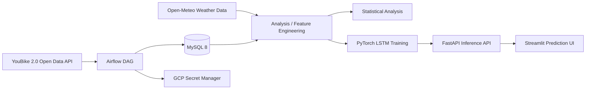

# Taipei YouBike 2.0 Data Engineering and Mobility Analytics

> A portfolio-scale data engineering and analytics project built on Taipei YouBike 2.0 open data, covering scheduled ingestion, relational data modeling, statistical analysis, LSTM training, and FastAPI model serving.

[中文 README](README.md)

## Summary

This project originated from a probability and statistics research report and was later extended into a data engineering and AI application portfolio project. The goal is to analyze supply-demand imbalance in Taipei's YouBike 2.0 system and evaluate whether high-frequency station data improves operational forecasting.

The project has three layers:

1. **Data engineering**: Airflow ingests YouBike station status every 10 minutes and stores normalized records in MySQL.
2. **Statistical analysis**: Descriptive statistics, t-tests, K-Means, ANOVA, chi-square testing, and regression are used to analyze station imbalance and regional behavior.
3. **Application serving**: A PyTorch LSTM model is served through FastAPI, with a Streamlit interface for prediction demos.

This repository is a **portfolio showcase**, not an actively operated production service.

## Key Results

| Area | Result |
| --- | --- |
| Data volume | Processed 4M+ YouBike station status records |
| Ingestion | 10-minute micro-batch ingestion with Airflow |
| Data model | Split static station metadata and dynamic status logs into dimension / fact tables |
| Analysis | Used CV, t-tests, ANOVA, chi-square testing, and regression to identify imbalance patterns |
| Forecasting | Built a Multi-Station LSTM with weather, station, and lag-style features |
| Serving | Exposed model inference through FastAPI and a Streamlit UI |
| Deployment evidence | Historical GCP VM deployment with Docker Compose, Airflow, MySQL, API, and dashboard services |
| Engineering hygiene | pytest coverage for ETL / API behavior and GitHub Actions CI |

## Problem Context

The operational problem is not simply a lack of bicycles. In many cases, bikes and empty docks are unevenly distributed across stations and time periods.

Common user pain points include:

- No bikes available at origin stations
- No empty docks at destination stations
- Sharp peak-hour imbalance between high-demand and low-demand areas

The analysis therefore focuses on variance, distribution shape, tail risk, and regional heterogeneity instead of city-wide averages alone.

## Architecture



## Data Model

The MySQL schema is defined in `sql/init_schema.sql`, and the downstream analytics model is documented in the `analytics/dbt` dbt scaffold. Airflow owns ingestion into raw warehouse tables; dbt owns the staging and mart layer for analysis.

### `station_info`

Station dimension table:

- `station_no`
- `name_tw`
- `district`
- `lat`
- `lng`
- `total_spaces`

### `station_status`

Time-series station status fact table:

- `station_no`
- `bikes_available`
- `spaces_available`
- `record_time`

The schema uses `(station_no, record_time)` as a uniqueness constraint to prevent duplicate status records.

### dbt analytics layer

`analytics/dbt` provides:

- `stg_station_info`: cleaned station dimension model
- `stg_station_status`: cleaned station status model with stock-out and full-load risk flags
- `mart_station_hourly_health`: hourly station health metrics for dashboarding and downstream analysis

Use `profiles.example.yml` as a template for a real `profiles.yml`. Do not commit credentials.

## Analytical Findings

### 1. Average Availability Hides Peak-Hour Instability

Peak and off-peak periods may show similar average availability, but the peak-hour coefficient of variation was around `0.7815`, indicating much higher instability during commute windows.

**Engineering implication**: station-level monitoring and high-frequency ingestion are necessary; city-wide daily aggregates are insufficient.

### 2. Campus Stations Behave Differently

t-tests showed that the NTU Gongguan area had significantly lower operating levels than nearby comparison areas. This suggests campus stations should not be managed only through district-level averages.

### 3. Land-Use Patterns Affect Station Behavior

K-Means clustering was used to categorize station behavior, followed by ANOVA and Tukey post-hoc comparison. The analysis separated commercial, residential, and mixed-use patterns.

Operational interpretation:

- Mixed-use areas tend to retain more bikes and need capacity-oriented planning.
- Commercial areas have higher turnover and need faster redistribution.
- Residential areas show stronger commute-driven rhythms.

### 4. Tail Risk Matters More Than the Mean

Chi-square testing and standardized residual analysis were used to identify severe stock-out hotspots. This better reflects real user experience than average availability alone.

### 5. High-Frequency Data Improves Predictive Power

Regression comparison showed that static location features alone had low explanatory power, while adding lag-style temporal features increased R-squared from roughly `0.02` to `0.92`.

**Engineering implication**: 10-minute ingestion is central to the predictive value of the system.

## Model Serving

The prediction service uses a Multi-Station LSTM with:

- current bike availability
- temperature
- rainfall
- rainfall category
- station ID embedding

FastAPI endpoints:

| Method | Path | Description |
| --- | --- | --- |
| GET | `/` | Service status |
| GET | `/stations` | Supported station list |
| POST | `/predict` | Predicts available bikes one hour later |

Example request:

```json
{
  "station_no": "500101001",
  "bikes_available": 12,
  "temperature": 27.5,
  "rain": 0.0
}
```

Example response:

```json
{
  "station_no": "500101001",
  "predicted_bikes_next_hour": 10
}
```

## Historical Deployment

This project was previously deployed on a GCP VM with Docker Compose. The original Tableau dashboard and Streamlit cloud demo were created for course presentation purposes and may no longer be online. For that reason, this README does not publish old VM IPs or expired demo links.

Evidence screenshots are retained for portfolio context:

### Airflow Scheduling


### Data Volume


### Docker Services


### GCP Monitoring


## Tech Stack

| Area | Technologies |
| --- | --- |
| Workflow | Apache Airflow |
| Data Processing | Python, Pandas, SQLAlchemy |
| Database | MySQL 8 |
| Backend | FastAPI, Pydantic, Uvicorn |
| ML | PyTorch, scikit-learn, joblib |
| Dashboard | Streamlit, Tableau |
| Infrastructure | Docker, Docker Compose, GCP VM, GCP Secret Manager |
| Analytics Engineering | dbt scaffold, source/model tests, staging/mart models |
| Testing / CI | pytest, FastAPI TestClient, GitHub Actions |

## Project Structure

```text
YouBike-ETL-Pipeline/
├── api/
│   ├── app/
│   │   └── main.py                 # FastAPI inference service
│   └── model_files/                # LSTM weights, scaler, station mappings
├── dags/
│   └── youbike_dag.py              # Airflow ETL DAG
├── dashboard/
│   └── app.py                      # Streamlit prediction UI
├── analytics/
│   └── dbt/                        # dbt analytics layer scaffold
├── docs/
│   ├── adr/                        # Maintenance decisions
│   └── images/                     # Deployment and data-volume evidence
├── notebooks/
│   ├── 01_youbike_analysis.ipynb
│   ├── 02_weather_etl.ipynb
│   ├── 03_data_merge.ipynb
│   ├── 04_lstm_prediction.ipynb
│   ├── 05_multistation_lstm.ipynb
│   └── 06_tableau_master_dataset.ipynb
├── sql/
│   └── init_schema.sql             # MySQL schema
├── tests/
│   ├── test_api.py                 # FastAPI behavior tests
│   └── test_etl.py                 # ETL transform tests
├── docker-compose.yaml
├── Dockerfile
├── Dockerfile.app
├── etl_job.py
├── Makefile
├── requirements.txt
├── requirements-dev.txt
├── requirements-dbt.txt
├── requirements-test.txt
└── requirements_app.txt
```

## Local Run

### 1. Create environment variables

```bash
cp .env.example .env
```

At minimum:

```env
MYSQL_ROOT_PASSWORD=your_root_password_here
MYSQL_DATABASE=youbike_db
MYSQL_USER=youbike
MYSQL_PASSWORD=your_app_password_here
```

### 2. Start services

```bash
make up
```

Default services:

- Airflow UI: http://localhost:8080
- FastAPI docs: http://localhost:8000/docs
- Streamlit dashboard: http://localhost:8501
- MySQL: localhost:3306

### 3. Run tests

```bash
make install-dev
make test
```

The tests cover ETL transform logic and basic FastAPI behavior. They do not require MySQL or GCP access and do not load real model artifacts.

GitHub Actions runs the same test suite on push and pull request events.

### 4. Run the dbt analytics scaffold

dbt is optional and requires a local `analytics/dbt/profiles.yml`:

```bash
cp analytics/dbt/profiles.example.yml analytics/dbt/profiles.yml
```

After setting the MySQL connection environment variables:

```bash
make install-dbt
make dbt-parse
make dbt-build
```

The public repository does not include database credentials, so CI currently runs Python tests only and does not execute `dbt build`.

## Test Coverage

Current tests cover:

- ETL empty-input and missing-column handling
- ETL successful transform behavior
- FastAPI health endpoint
- `/stations` model-not-ready behavior
- `/predict` request validation
- unknown station handling
- mocked model prediction response

CI configuration lives in `.github/workflows/ci.yml`.

## Known Limitations

- This repository is a portfolio showcase, not an actively operated production service.
- The Tableau dashboard and old Streamlit cloud demo may no longer be online.
- ETL logic is still partially duplicated between `etl_job.py` and `dags/youbike_dag.py`.
- The dbt analytics layer is currently a scaffold and needs a real MySQL warehouse connection for full `dbt build` execution.
- The current `/predict` demo constructs a short sequence from the current state; production forecasting should use real lag windows from the database.
- Notebook-based training has not yet been converted into a fully reproducible training script.

## Role Relevance

This project is most relevant to:

- Data engineering: ETL, Airflow, MySQL schema design, batch ingestion, data-quality testing
- Data application engineering: analytics, feature engineering, model serving, dashboard support
- Backend / AI application engineering: FastAPI, Pydantic validation, inference APIs, Docker Compose

It does not claim to cover full-scale big-data platform work such as Spark, Kafka, dbt, Data Lake, Kubernetes, or complete MLOps.

## Maintenance Roadmap

1. Extract shared ETL logic into a reusable module.
2. Connect the dbt scaffold to a reproducible local sample warehouse or fixture dataset.
3. Add `/predict/batch` or `/stations/risk` for multi-station risk ranking.
4. Convert notebook training into a reproducible training script.
5. Add data-quality checks for schema, duplicates, and time gaps.

## Author

Kevin Lin, 2025
