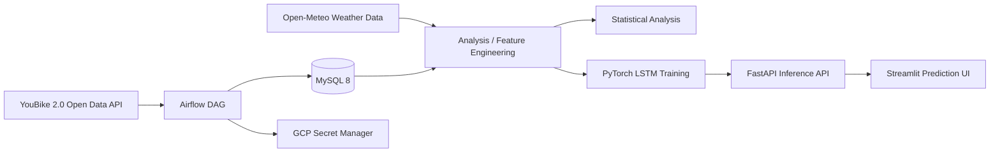

# 台北 YouBike 2.0 資料工程與交通效能分析

> 以台北市 YouBike 2.0 開放資料為基礎，建置一套涵蓋資料擷取、排程編排、關聯式資料建模、統計分析、模型訓練與 API 服務化的資料應用專案。

[English README](README.en.md)

## 專案摘要

本專案源自「機率與統計」課程研究，後續延伸為資料工程與 AI 應用作品。研究目標是分析台北市 YouBike 2.0 系統在尖峰時段的供需失衡問題，並驗證高頻資料擷取對即時預測與調度決策的價值。

專案實作包含三個層次：

1. **資料工程層**：以 Airflow 每 10 分鐘擷取 YouBike 即時站點資料，將站點靜態資訊與即時狀態寫入 MySQL。
2. **統計分析層**：使用描述統計、t 檢定、K-Means、ANOVA、卡方檢定與迴歸模型，分析站點失衡、土地使用型態與尖峰波動。
3. **應用服務層**：將 PyTorch LSTM 模型封裝為 FastAPI 推論服務，並以 Streamlit 建立互動式預測介面。

此 repo 目前定位為 **portfolio showcase**，用於展示資料管線設計、資料建模、統計分析與模型服務化能力；不是目前仍在線上營運的 production service。

## 核心成果

| 面向 | 成果 |
| --- | --- |
| 資料規模 | 累積處理超過 4M 筆 YouBike 站點狀態紀錄 |
| 擷取頻率 | 以 Airflow micro-batch 每 10 分鐘擷取一次即時資料 |
| 資料建模 | 使用 `station_info` 維度表與 `station_status` 事實表分離靜態與動態資料 |
| 統計分析 | 使用 CV、t 檢定、ANOVA、卡方檢定與迴歸分析定位缺車熱點 |
| 預測建模 | 使用 Multi-Station LSTM 整合站點、天氣與歷史狀態特徵 |
| 服務化 | 以 FastAPI 提供模型推論 API，Streamlit 提供互動式操作介面 |
| 部署證據 | 曾以 Docker Compose 部署於 GCP VM，並保留 Airflow、Docker、GCP 監控截圖 |
| 工程化維護 | 以 pytest 覆蓋 ETL / API 基礎行為，並以 GitHub Actions 自動執行測試 |

## 問題背景

YouBike 的核心營運問題不只是「車輛總量不足」，而是不同時間、不同區域、不同站點之間的供需錯置。使用者常見痛點包含：

- 到站後無車可借
- 抵達目的地後無位可還
- 尖峰時段部分站點快速耗盡，部分站點卻仍有餘裕

因此，本專案不是只看全市平均使用率，而是從 **變異、分佈、尾端風險與區域異質性** 出發，分析哪些站點或區域需要更高頻的調度策略。

## 系統架構



### 資料流程

1. Airflow DAG 定期呼叫 YouBike 2.0 即時資料 API。
2. ETL 將站點靜態資料與即時狀態資料拆分。
3. MySQL 儲存正規化後的站點維度表與狀態事實表。
4. Notebook 使用歷史資料進行統計分析、特徵工程與模型訓練。
5. FastAPI 在啟動時載入模型權重與 scaler，對外提供預測 endpoint。
6. Streamlit dashboard 呼叫 API，展示站點預測結果與調度建議。

## 資料模型

MySQL schema 定義位於 `sql/init_schema.sql`，下游分析模型則以 `analytics/dbt` 的 dbt scaffold 描述。Airflow 負責把資料寫入 raw warehouse tables，dbt 負責將資料整理成分析用 staging / marts layer。

### `station_info`

站點維度表，保存低變動資料：

- `station_no`
- `name_tw`
- `district`
- `lat`
- `lng`
- `total_spaces`

### `station_status`

站點狀態事實表，保存高頻時間序列資料：

- `station_no`
- `bikes_available`
- `spaces_available`
- `record_time`

Schema 以 `(station_no, record_time)` 作為唯一鍵，避免同一站點同一時間重複寫入。

### dbt analytics layer

`analytics/dbt` 提供 seed fixtures 與以下模型：

- `station_info` / `station_status` seeds：CI 使用的小型 raw warehouse 測試資料
- `stg_station_info`：清理後的站點維度模型
- `stg_station_status`：清理後的站點狀態模型，加入缺車與滿站風險 flags
- `mart_station_hourly_health`：小時層級站點營運健康指標，可供 dashboard 或後續分析使用

dbt profiles 使用 `profiles.example.yml` 作為範本。實際 `profiles.yml` 需要使用本機或部署環境的 MySQL credentials，且不應提交到 Git。CI 會啟動 disposable MySQL service，執行 `dbt seed` 與 `dbt build`。

## 分析方法與發現

### 1. 平均值陷阱：尖峰問題來自高變異

單看平均滿車率會低估問題。報告中比較尖峰與離峰時段後發現，尖峰時段的變異係數（CV）約為 `0.7815`，顯著高於離峰時段。這代表尖峰時刻的問題不是全市平均水位，而是站點間分佈高度不均。

**工程意義**：需要高頻資料擷取與站點層級監控，不能只用每日或全市平均資料做決策。

### 2. 校園區域效應：臺大公館缺車風險異常

透過單一樣本 t 檢定與兩獨立樣本 t 檢定，報告將臺大公館區域與鄰近大安區進行比較，發現校園周邊站點的水位顯著偏低。這代表校園區域具有獨立於一般行政區的需求型態。

**決策意義**：校園站點不適合只依行政區平均調度，應建立獨立補給策略。

### 3. 土地使用型態：不同區域來自不同分佈

專案先以 K-Means 將站點行為分成商業型、住宅型與混合型，再使用 ANOVA 與 Tukey 事後比較檢驗不同區域型態的營運差異。

觀察到的策略方向：

- 混合區（如萬華）：偏高滯留，適合改善空間容量
- 商業區（如信義）：偏高週轉，適合提高調度頻率
- 住宅區（如文山）：通勤波形明顯，適合依尖峰時段調整補車

### 4. 缺車風險定位：用尾端事件取代平均指標

報告使用卡方檢定與標準化殘差分析定位嚴重缺車熱點。這類方法能補足平均值無法描述的「尾端風險」，更貼近使用者實際遇到的「借不到車」情境。

### 5. 高頻資料的預測價值

迴歸模型比較顯示，只使用靜態地點特徵時，模型解釋力很低；加入時間滯後特徵（lag feature）後，解釋力大幅提升，報告中 R-squared 從約 `0.02` 提升到約 `0.92`。

**工程意義**：每 10 分鐘擷取一次資料不是裝飾，而是讓預測模型能利用時間序列自相關性的關鍵。

## 模型與 API

模型採用 Multi-Station LSTM，輸入特徵包含：

- 目前可借車數
- 氣溫
- 降雨量
- 降雨分級 `Rain_Cat`
- 站點 ID embedding

FastAPI endpoint：

| Method | Path | 說明 |
| --- | --- | --- |
| GET | `/` | 服務狀態 |
| GET | `/stations` | 回傳模型支援的站點清單 |
| POST | `/predict` | 預測指定站點一小時後的可借車數 |

範例 request：

```json
{
  "station_no": "500101001",
  "bikes_available": 12,
  "temperature": 27.5,
  "rain": 0.0
}
```

範例 response：

```json
{
  "station_no": "500101001",
  "predicted_bikes_next_hour": 10
}
```

## 部署與歷史展示

本專案曾部署於 GCP VM，透過 Docker Compose 管理 Airflow、MySQL、FastAPI 與 Streamlit。原本的 Tableau dashboard 與 Streamlit 預測網站屬於課程展示用雲端 demo，目前不保證仍在線上，因此 README 不公開舊 VM IP 或失效連結。

保留以下截圖作為歷史部署與資料規模證據：

### Airflow 排程


### 資料量


### Docker Compose 服務


### GCP 監控


## 技術棧

| 類別 | 技術 |
| --- | --- |
| Workflow | Apache Airflow |
| Data Processing | Python, Pandas, SQLAlchemy |
| Database | MySQL 8 |
| Backend | FastAPI, Pydantic, Uvicorn |
| ML | PyTorch, scikit-learn, joblib |
| Dashboard | Streamlit, Tableau |
| Infrastructure | Docker, Docker Compose, GCP VM, GCP Secret Manager |
| Analytics Engineering | dbt scaffold, source/model tests, staging/mart models |
| Testing / CI | pytest, FastAPI TestClient, GitHub Actions |

## 專案結構

```text
YouBike-ETL-Pipeline/
├── api/
│   ├── app/
│   │   └── main.py                 # FastAPI 模型推論服務
│   └── model_files/                # LSTM 權重、scaler、站點 mapping
├── dags/
│   └── youbike_dag.py              # Airflow ETL DAG
├── dashboard/
│   └── app.py                      # Streamlit 預測介面
├── analytics/
│   └── dbt/                        # dbt analytics layer scaffold
├── docs/
│   ├── adr/                        # 維護決策紀錄
│   └── images/                     # 部署與資料規模截圖
├── notebooks/
│   ├── 01_youbike_analysis.ipynb
│   ├── 02_weather_etl.ipynb
│   ├── 03_data_merge.ipynb
│   ├── 04_lstm_prediction.ipynb
│   ├── 05_multistation_lstm.ipynb
│   └── 06_tableau_master_dataset.ipynb
├── sql/
│   └── init_schema.sql             # MySQL schema
├── tests/
│   ├── test_api.py                 # FastAPI 行為測試
│   └── test_etl.py                 # ETL transform 測試
├── docker-compose.yaml
├── Dockerfile
├── Dockerfile.app
├── etl_job.py
├── Makefile
├── requirements.txt
├── requirements-dev.txt
├── requirements-dbt.txt
├── requirements-test.txt
└── requirements_app.txt
```

## 本機執行

### 1. 建立環境變數

```bash
cp .env.example .env
```

至少需要設定：

```env
MYSQL_ROOT_PASSWORD=your_root_password_here
MYSQL_DATABASE=youbike_db
MYSQL_USER=youbike
MYSQL_PASSWORD=your_app_password_here
```

### 2. 啟動服務

```bash
make up
```

預設服務：

- Airflow UI: http://localhost:8080
- FastAPI docs: http://localhost:8000/docs
- Streamlit dashboard: http://localhost:8501
- MySQL: localhost:3306

### 3. 執行測試

```bash
make install-dev
make test
```

測試涵蓋 ETL transform 與 FastAPI 基礎行為，不需要連線到 MySQL 或 GCP，也不會載入真實模型檔。

GitHub Actions 會在 push / pull request 時自動執行 Python 測試，並啟動 MySQL service 執行 dbt seed/build。

### 4. 執行 dbt analytics scaffold

dbt 是可選的分析層，需要先建立 `analytics/dbt/profiles.yml`：

```bash
cp analytics/dbt/profiles.example.yml analytics/dbt/profiles.yml
```

設定好 MySQL 連線環境變數後執行：

```bash
make install-dbt
make dbt-parse
make dbt-build
```

`make install-dbt` 會建立專用 `.venv-dbt`，避免污染系統 Python。`dbt-mysql` 目前以 Python 3.11 驗證；如果本機預設是 Python 3.12+，可用 `DBT_PYTHON=/path/to/python3.11 make install-dbt` 指定安裝環境。

公開 repo 不包含實際 database credentials；CI 使用一次性的 MySQL service 與 seed fixture 驗證 dbt layer。

## 測試狀態

目前測試包含：

- ETL 空資料與缺欄位錯誤處理
- ETL 正常轉換結果
- FastAPI health endpoint
- `/stations` model-not-ready 行為
- `/predict` request validation
- unknown station 錯誤處理
- mocked model prediction response
- dbt seed fixtures、source/model tests、staging/mart build

CI 設定位於 `.github/workflows/ci.yml`。

## 已知限制

- 本專案是作品展示，不是目前持續營運的 production service。
- Tableau dashboard 與舊 Streamlit 雲端 demo 可能已失效，README 不依賴這些連結。
- `etl_job.py` 與 `dags/youbike_dag.py` 仍有部分 ETL 邏輯重複，後續可抽成共用 module。
- dbt analytics layer 目前使用 seed fixtures 驗證模型結構；若要分析完整資料，需要連接實際 MySQL warehouse。
- `/predict` 的即時 demo 會用目前狀態組成短序列；若要做更嚴謹的 production forecasting，應改由資料庫查詢真實 lag window。
- Notebook 訓練流程尚未完全轉成可重現的 training script。

## 與職缺能力的對應

這個專案最適合對應以下職務能力：

- 資料工程：ETL、Airflow、MySQL schema、批次資料擷取、資料品質測試
- 數據應用工程：資料分析、特徵工程、模型服務化、Dashboard 支援
- 後端 / AI 應用：FastAPI、Pydantic validation、模型推論 API、Docker Compose

它不主張涵蓋完整大數據平台能力，例如 Spark、Kafka、dbt、Data Lake、Kubernetes 或完整 MLOps；若要投遞偏中高階資料平台職缺，仍需要其他作品或後續擴充。

## 後續維護方向

1. 抽出共用 ETL module，消除 DAG 與 standalone job 的重複邏輯。
2. 加入 `/predict/batch` 或 `/stations/risk`，輸出多站點缺車風險排序。
3. 將 notebook 訓練流程整理成可重現的 training script。
4. 補充資料品質檢查，例如欄位 schema validation、重複資料檢查與時間斷點檢查。
5. 擴充 dbt marts，加入行政區 / 尖峰時段分析模型。

## 作者

Kevin Lin, 2025
