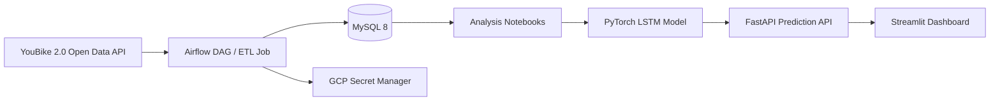

# 台北 YouBike 2.0 預測與資料應用系統

> AI 後端 / 資料應用作品集：Airflow ETL、MySQL 時序資料、FastAPI 模型服務、Streamlit 操作介面、PyTorch LSTM 預測。

[English README](README.en.md)

## 專案定位

這是一個以台北市 YouBike 2.0 開放資料為主題的資料應用作品。專案從即時站點資料擷取開始，將站點基本資料與即時狀態寫入 MySQL，再透過 Airflow 排程維持資料流，最後以 FastAPI 提供 LSTM 模型推論 API，並用 Streamlit 做出可操作的預測介面。

這個 repo 的重點不是把 YouBike 營運問題包裝成大型商業產品，而是展示我能把資料流、後端 API、模型推論與容器化部署串成一個可說明、可維護、可展示的系統。

適合用來補充以下能力：

- 後端服務設計：FastAPI endpoint、Pydantic validation、模型資源啟動載入
- AI 應用整合：PyTorch LSTM 模型封裝成 REST API
- 資料工程基礎：Airflow 排程、ETL、MySQL schema、時間序列資料寫入
- 容器化部署：Docker Compose 管理 Airflow、MySQL、API、Dashboard
- 資料分析敘事：統計檢定、分群、尖離峰與站點失衡分析

## 系統總覽



核心資料表：

- `station_info`：站點維度表，保存站點編號、名稱、行政區、經緯度與總車位數
- `station_status`：站點狀態事實表，保存每次擷取時的可借車數、可還車位與記錄時間

## 專案成果

本專案曾以 GCP VM + Docker Compose 部署，並累積超過 4M 筆 YouBike 站點狀態資料。README 中保留截圖作為 portfolio evidence，但不公開 VM IP、帳號、密碼或雲端專案細節。

### Airflow 排程


- Airflow DAG 每 10 分鐘擷取一次 YouBike 2.0 即時資料
- ETL 會拆分站點基本資料與站點狀態資料
- 站點狀態以 append-only 方式寫入 `station_status`

### 資料量證據


- 累積處理超過 4M 筆站點狀態資料
- MySQL schema 使用 station dimension + status fact table，避免站點基本資料重複儲存

### 容器與雲端部署


- Docker Compose 管理 Airflow webserver、scheduler、MySQL、FastAPI、Streamlit
- GCP Secret Manager 用於部署環境中的資料庫密碼讀取
- 本 repo 僅保留 `.env.example`，不提交實際 `.env`

### 基礎雲端監控


- 曾在 GCP VM 上觀察 ETL 排程造成的 CPU 與網路流量變化
- 截圖用於說明部署與排程曾實際運作，不代表目前仍持續營運

## 分析重點

### 1. 平均值陷阱

尖峰與離峰時段的平均可用率可能接近，但尖峰時段的波動更高。這代表問題不只是總供給不足，而是不同站點之間的供需失衡。

### 2. 校園區域效應

台大公館周邊站點在特定時段容易出現缺車或滿站問題，需求型態與一般商業區不同。這讓模型與調度策略需要考慮站點所在區域，而不是只看行政區平均值。

### 3. 土地使用型態差異

不同區域，例如住宅區、商業區、混合使用區，會呈現不同的借還車節奏。Notebook 中以統計分析與分群方式探索這些差異。

### 4. 動態特徵的重要性

只用站點位置很難預測車輛數，加入 lag features 後模型表現明顯改善。這也是本專案保留即時 ETL 與時間序列資料庫的原因。

## API 與 Dashboard

FastAPI 服務位於 `api/app/main.py`，主要 endpoint：

- `GET /`：服務狀態
- `GET /stations`：模型支援的站點清單
- `POST /predict`：輸入站點、目前車輛數、氣溫、降雨量，回傳一小時後預測車輛數

範例 request：

```json
{
  "station_no": "500101001",
  "bikes_available": 12,
  "temperature": 27.5,
  "rain": 0.0
}
```

範例 response：

```json
{
  "station_no": "500101001",
  "predicted_bikes_next_hour": 10
}
```

Streamlit dashboard 位於 `dashboard/app.py`，提供站點選擇、天氣參數輸入與預測結果展示。

## 技術棧

- Backend：FastAPI、Pydantic、Uvicorn
- ML / AI：PyTorch LSTM、scikit-learn、joblib
- Data Engineering：Airflow、Pandas、SQLAlchemy
- Database：MySQL 8
- Dashboard：Streamlit
- Infra：Docker、Docker Compose、GCP VM、GCP Secret Manager
- Analysis：Jupyter Notebook、statistical testing、clustering、model comparison

## 專案結構

```text
YouBike-ETL-Pipeline/
├── api/
│   ├── app/
│   │   └── main.py                 # FastAPI 模型推論服務
│   └── model_files/                # LSTM 權重、scaler、站點 mapping
├── dags/
│   └── youbike_dag.py              # Airflow ETL DAG
├── dashboard/
│   └── app.py                      # Streamlit 預測介面
├── data/
│   └── raw/                        # 分析用原始資料
├── docs/
│   ├── adr/                        # 維護決策紀錄
│   └── images/                     # portfolio evidence 截圖
├── notebooks/
│   ├── 01_youbike_analysis.ipynb
│   ├── 02_weather_etl.ipynb
│   ├── 03_data_merge.ipynb
│   ├── 04_lstm_prediction.ipynb
│   ├── 05_multistation_lstm.ipynb
│   └── 06_tableau_master_dataset.ipynb
├── sql/
│   └── init_schema.sql             # MySQL schema
├── tests/
│   └── test_etl.py                 # ETL transform 單元測試
├── docker-compose.yaml
├── Dockerfile                      # Airflow image
├── Dockerfile.app                  # API / Dashboard image
├── etl_job.py                      # 可獨立執行的 ETL job
├── Makefile                        # 本機維護指令
├── requirements.txt
├── requirements-dev.txt
├── requirements-test.txt
└── requirements_app.txt
```

## 本機執行

### 1. 建立環境變數

```bash
cp .env.example .env
```

至少需要設定：

```env
MYSQL_ROOT_PASSWORD=your_root_password_here
MYSQL_DATABASE=youbike_db
MYSQL_USER=youbike
MYSQL_PASSWORD=your_app_password_here
```

### 2. 啟動服務

```bash
make up
```

預設服務：

- Airflow UI：http://localhost:8080
- FastAPI docs：http://localhost:8000/docs
- Streamlit dashboard：http://localhost:8501
- MySQL：localhost:3306

### 3. 執行測試

```bash
make install-dev
make test
```

目前測試涵蓋 ETL transform 邏輯與 FastAPI 基礎行為，不需要連線到 MySQL 或 GCP，也不會載入真實模型檔。

`requirements-dev.txt` 目前只安裝本機測試所需依賴；完整 notebook / 分析環境可另外安裝 `requirements.txt`。

若不使用 `make`，也可以直接執行原始指令：

```bash
docker-compose up -d --build
python -m pip install -r requirements-test.txt
python -m pytest tests/ -v
```

## 模型訓練

主要訓練流程位於：

```text
notebooks/05_multistation_lstm.ipynb
```

訓練完成後，模型與前處理資源會放在：

```text
api/model_files/
```

FastAPI 啟動時會載入：

- `youbike_lstm_multistation.pth`
- `scaler.pkl`
- `station_mapping.pkl`
- `station_info_map.pkl`

## 已知限制

這個專案是 portfolio showcase，不是目前仍在營運的 production service。

- ETL 邏輯目前在 `etl_job.py` 與 `dags/youbike_dag.py` 有重複，後續可抽成共用模組
- `POST /predict` 在即時 demo 中使用目前狀態組成短序列，適合展示模型 serving 流程；若要做嚴謹 forecasting，應改用資料庫中的真實 lag window
- Notebook 訓練流程尚未完全 pipeline 化，若要長期維護可補上可重現的 training script
- 部署截圖是歷史證據，公開文件不提供 VM IP 或雲端資源細節

## 面試時可以怎麼介紹

一句話版本：

> 我做了一個 YouBike 預測資料應用，從 Airflow ETL、MySQL 時序資料、LSTM 模型訓練，到 FastAPI 推論服務與 Streamlit dashboard，累積處理過 4M+ 筆站點狀態資料。

偏後端版本：

> 這個專案展示我如何把模型封裝成 API，處理 request validation、模型啟動載入、Docker Compose 服務網路，以及 API 與 dashboard 的串接。

偏 AI 應用版本：

> 這個專案不是只停在 notebook，而是把 LSTM 預測模型接到 FastAPI，讓前端 dashboard 可以呼叫模型推論，形成可互動的 AI application prototype。

偏資料工程版本：

> 這個專案用 Airflow 定期擷取 YouBike 即時資料，寫入 MySQL dimension/fact schema，並用累積資料支援後續統計分析與模型訓練。

## 後續維護方向

短期優先：

1. 將 ETL transform/load 抽成共用 Python module，讓 Airflow DAG 只負責 orchestration
2. 擴充 FastAPI endpoint tests，加入更多推論邊界條件
3. 擴充本機驗證流程，例如 docker compose health check
4. 補一個 batch risk endpoint，例如 `/stations/risk`，讓作品更貼近 AI 應用工程師職缺

## 作者

Kevin Lin, 2025
